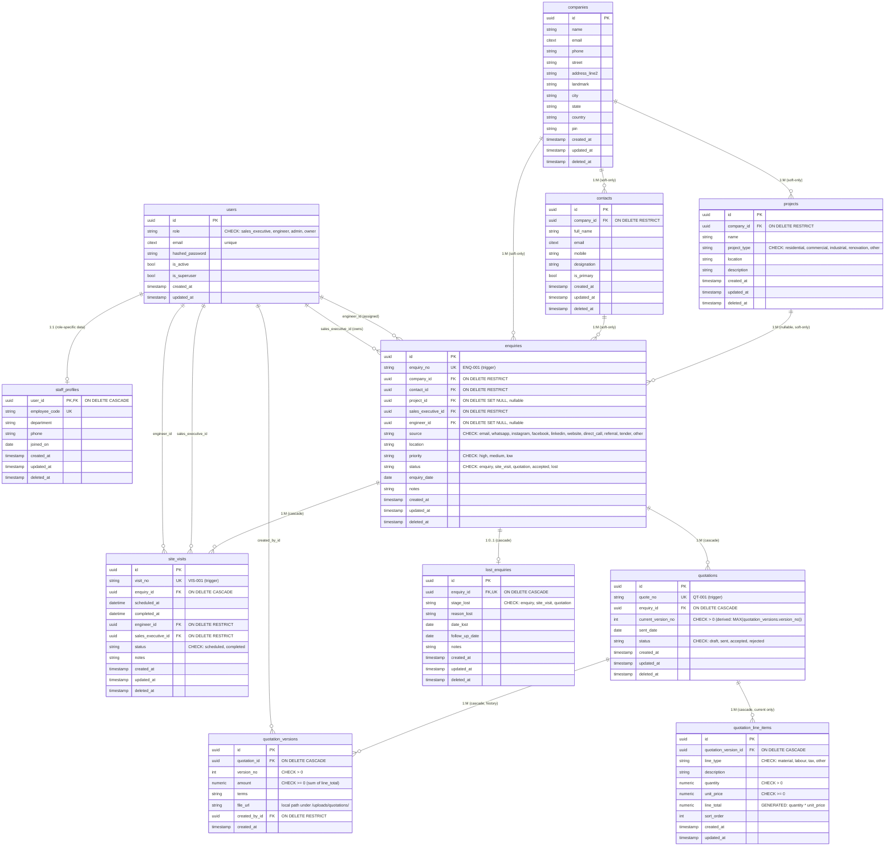
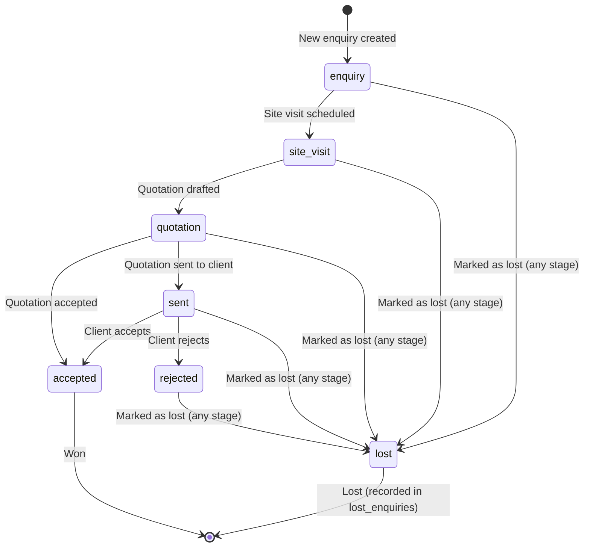

# CRM Module — Entity Relationship Diagram

This document visualizes the database schema for the Kailash CRM module. Render the Mermaid block below in any Markdown viewer that supports Mermaid (GitHub, VS Code with Mermaid extension, Obsidian, etc.).

---

## High-Level Relationships

---

## Status & Funnel Flow

---

## Soft-Delete Policy

Two classes of entities, two policies:

- **Soft-delete only** (set `deleted_at`, never `DELETE FROM`): `companies`, `contacts`, `projects`, `enquiries`. These carry business history; once created, never destroyed.
- **Cascade-delete** (no `deleted_at` on these; deleted when parent goes): `site_visits`, `quotations`, `quotation_versions`, `quotation_line_items`, `lost_enquiries`. They're owned data — if the enquiry is hard-deleted (rare, admin-only), everything goes.

Practical consequence: every FK from a soft-delete entity uses `ON DELETE RESTRICT` (the app sets `deleted_at` instead). FKs from cascade-delete entities use `ON DELETE CASCADE`.

This narrows the partial-index burden: `WHERE deleted_at IS NULL` is needed only on the four soft-delete tables, not on every read query.

---

## Index Strategy

| Table | Index | Purpose |
|-------|-------|---------|
| `enquiries` | `ix_enquiries_exec_status (sales_executive_id, status) WHERE deleted_at IS NULL` | Sales rep dashboard: "my open enquiries by status" |
| `enquiries` | `ix_enquiries_status_date (status, enquiry_date DESC) WHERE deleted_at IS NULL` | Funnel reports: "all accepted this month" |
| `enquiries` | `ix_enquiries_active_no (enquiry_no) WHERE deleted_at IS NULL` | Lookups by human number |
| `enquiries` | `ix_enquiries_engineer_status (engineer_id, status) WHERE deleted_at IS NULL` | Engineer workload view |
| `site_visits` | `ix_site_visits_enquiry_scheduled (enquiry_id, scheduled_at DESC)` | Enquiry timeline |
| `site_visits` | `ix_site_visits_engineer_date (engineer_id, scheduled_at)` | Engineer schedule view |
| `quotations` | `ix_quotations_enquiry_status (enquiry_id, status)` | Enquiry detail page |
| `quotation_versions` | `uq_quotation_versions_quote_version (quotation_id, version_no)` | Unique version per quote + drives `current_version_no` lookup |
| `quotation_line_items` | `ix_quotation_lines_version_order (quotation_version_id, sort_order)` | Render breakdown in display order |
| `lost_enquiries` | `ix_lost_follow_up (follow_up_date) WHERE follow_up_date IS NOT NULL` | "Follow-ups due" dashboard (no `deleted_at` filter — table is cascade-only) |
| `contacts` | `uq_contacts_company_primary (company_id) WHERE is_primary AND deleted_at IS NULL` | One primary contact per company |
| `companies` | `ix_companies_active_name (name) WHERE deleted_at IS NULL` | Autocomplete / search |

---

## Cardinality Cheat-Sheet

| From | Cardinality | To | Notes |
|------|-------------|----|-------|
| `users` | 1 : 0..1 | `staff_profiles` | Role-specific data |
| `users` (sales exec) | 1 : M | `enquiries` | Owns the enquiry |
| `users` (engineer) | 1 : M | `enquiries` | May be assigned |
| `companies` | 1 : M | `contacts` | RESTRICT (app sets `deleted_at`) |
| `companies` | 1 : M | `projects` | RESTRICT (app sets `deleted_at`) |
| `companies` | 1 : M | `enquiries` | RESTRICT (app sets `deleted_at`) |
| `contacts` | 1 : M | `enquiries` | RESTRICT |
| `projects` | 1 : M | `enquiries` | SET NULL on delete |
| `enquiries` | 1 : M | `site_visits` | Cascade |
| `enquiries` | 1 : M | `quotations` | Cascade |
| `enquiries` | 1 : 0..1 | `lost_enquiries` | Cascade; unique constraint enforces 1:1 |
| `quotations` | 1 : M | `quotation_versions` | Cascade (history preserved) |
| `quotation_versions` | 1 : M | `quotation_line_items` | Cascade (line items belong to a specific version, not the quote) |
| `users` | 1 : M | `quotation_versions` (created_by) | RESTRICT (audit trail) |

---

## Lifecycle Example: An Enquiry Through the Funnel

1. **Create enquiry** → trigger assigns `ENQ-001`. `status=enquiry`. `sales_executive_id` set to creator.
2. **Schedule site visit** → trigger assigns `VIS-001`. Enquiry `status=site_visit`. `engineer_id` set.
3. **Draft quotation** → trigger assigns `QT-001`. v1 row inserted in `quotation_versions`; line items go on v1 (`quotation_version_id`, not `quotation_id`). Enquiry `status=quotation`.
4. **Add V2** → new row in `quotation_versions` (version_no=2) with its own line items. `quotations.current_version_no` updated to 2 (app-level: `UPDATE quotations SET current_version_no = 2 WHERE id = ?`).
5. **Send quotation** → `quotations.status=sent`, `sent_date=now()`.
6. **Client accepts** → `quotations.status=accepted`. Enquiry `status=accepted`.
7. **(Alt path) Mark lost** → row created in `lost_enquiries` (1:1). Enquiry `status=lost`. `lost_enquiries.follow_up_date` set.

### Quotation amount — derived, never stored

- `quotation_versions.amount` = `SUM(quotation_line_items.line_total)` for that version, computed on read or maintained by app on line-item changes.
- `quotation_line_items.line_total` is a `GENERATED ALWAYS AS (quantity * unit_price) STORED` column — cannot drift.
- `quotations` itself has no `amount` column. The "current" amount is the sum from the latest `quotation_versions` row.
